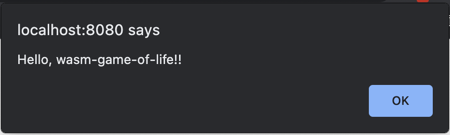
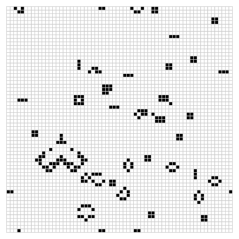

# rust-wasm

https://rustwasm.github.io/docs/book/introduction.html

## Install [Rust](https://www.rust-lang.org/tools/install)

```shell
$ curl --proto '=https' --tlsv1.2 -sSf https://sh.rustup.rs | sh
```

## Install [wasm-pack](https://rustwasm.github.io/wasm-pack/installer/)

Building, testing, and publishing Rust-generated WebAssembly.

````shell
$ curl https://rustwasm.github.io/wasm-pack/installer/init.sh -sSf | sh
````

## Install [cargo-generate](https://github.com/cargo-generate/cargo-generate)

Make a project.

```shell
$ cargo install cargo-generate
```

## Install [npm](https://docs.npmjs.com/getting-started)

Package manager for JavaScript.

```shell
$ npm install npm@latest -g
```

## Clone project

```shell
$ cargo generate --git https://github.com/rustwasm/wasm-pack-template
```

### Build the Project

```shell
$ cd wasm-game-of-life
$ wasm-pack build 
```

### Output

```shell
pkg
├── README.md
├── package.json
├── wasm_game_of_life.d.ts
├── wasm_game_of_life.js
├── wasm_game_of_life_bg.js
├── wasm_game_of_life_bg.wasm
└── wasm_game_of_life_bg.wasm.d.ts
```

### Putting it into a Web Page

```shell
$ cd wasm-game-of-life
$ npm init wasm-app www
```

### Output

```shell
wasm-game-of-life/www/
├── bootstrap.js
├── index.html
├── index.js
├── LICENSE-APACHE
├── LICENSE-MIT
├── package.json
├── README.md
└── webpack.config.js
```

### Shrinking `.wasm` Size

```shell
$ wc -c pkg/wasm_game_of_life_bg.wasm
17317 pkg/wasm_game_of_life_bg.wasm
```

### Add package in `package.json`

```shell
"dependencies": {                     // Add this three lines block!
  "wasm-game-of-life": "file:../pkg"
},
```

### Install package

```shell
$ npm install
```

### Modify `www/wasm-game-of-life/index.js`

```shell
import * as wasm from "wasm-game-of-life";

wasm.greet("wasm-game-of-life!");
```

### Serving Locally

```shell
$ npm run start
```

### Result





## Publishing to npm

First, [make sure you have an npm account](https://www.npmjs.com/signup)

Second, make sure you are logged

```shell
$ wasm-pack login
```

## Publishing

- Build

```shell
$ wasm-pack build
```

- Publish

Upload the package to npm

```shell
$ wasm-pack publish
```

## Crates You Should Know

https://rustwasm.github.io/docs/book/reference/crates.html

- [wasm-bindgen](https://crates.io/crates/wasm-bindgen) facilitates high-level interactions between Rust and JavaScript.
- [wasm-bindgen-futures](https://crates.io/crates/wasm-bindgen-futures) is a bridge connecting JavaScript Promises and
  Rust Future.
- [js-sys](https://crates.io/crates/js-sys) imports for all the JavaScript global types and methods, such as Object,
  Function, eval, etc. These APIs are portable across all standard ECMAScript environments, not just the Web, such as
  Node.js.
- [web-sys](https://crates.io/crates/web-sys) imports for all the Web's APIs, such as DOM manipulation, setTimeout, Web
  GL, Web Audio, etc.
- [console_error_panic_hook](https://crates.io/crates/console_error_panic_hook) lets you debug panics on
  wasm32-unknown-unknown by providing a panic hook that forwards panic messages to `console.error`.
- [console_log](https://crates.io/crates/console_log) logged messages to the devtools console.
- [log](https://crates.io/crates/log) logged messages to the devtools console.
- [wee_alloc](https://crates.io/crates/wee_alloc) The Wasm-Enabled, Elfin Allocator. A small (~1K uncompressed `.wasm`)
  allocator implementation for when code size is a greater concern than allocation performance.
- [parity-wasm](https://crates.io/crates/parity-wasm) Low-level WebAssembly format library for serializing,
  deserializing, and building .wasm binaries.
- [wasmparser](https://crates.io/crates/wasmparser) A simple, event-driven library for parsing WebAssembly binary files.
- [wasmi](https://crates.io/crates/wasmi) An embeddable WebAssembly interpreter from Parity.
- [cranelift-wasm](https://crates.io/crates/cranelift-wasm) Compile WebAssembly to the native host's machine code. Part
  of the Cranelift (né Cretonne) code generator project.

## Tools You Should Know

- [wasm-pack](https://github.com/rustwasm/wasm-pack) seeks to be a one-stop shop for building and working with Rust- generated WebAssembly that you would like to interoperate with JavaScript, on the Web or with Node.js.

## Optimizing and Manipulating .wasm Binaries

- [wasm-opt](https://github.com/WebAssembly/binaryen) 

## Debugging Rust-Generated WebAssembly

```shell
$ wasm-pack build --debug
```

or

```toml
[profile.release]
debug = true
```

## Deploying Rust and WebAssembly to Production

